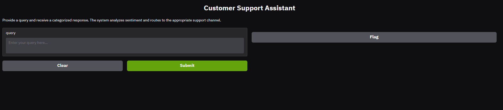

# Customer Support Agent

- An AI-powered customer support assistant with a modern web interface. 
- It uses large language models to categorize, analyze, and respond to customer queries automatically.

## Features
- Categorizes queries as Technical, Billing, or General
- Analyzes sentiment (Positive, Neutral, Negative)
- Escalates negative queries
- Generates helpful responses using LLMs
- Clean, responsive Gradio UI

## Setup
1. Clone this repository and enter the folder:
	```bash
	git clone https://github.com/i-Faith/customer_support_agent.git
	cd customer_support_agent
	```
2. Install dependencies:
	```bash
	pip install -r requirements.txt
	```
3. Add your Groq API key to a `.env` file:
	```env
	GROQ_API_KEY=your_groq_api_key_here
	```

## Usage
Run the app:
```bash
python app.py
```
Open the link in your browser. Enter a customer query and click Submit to get a categorized, sentiment-analyzed response.

## Files
- `app.py` — Main application
- `requirements.txt` — Dependencies
- `customer_agent.ipynb` — (Optional) Notebook for experiments

- Here is a screenshot of the interface


